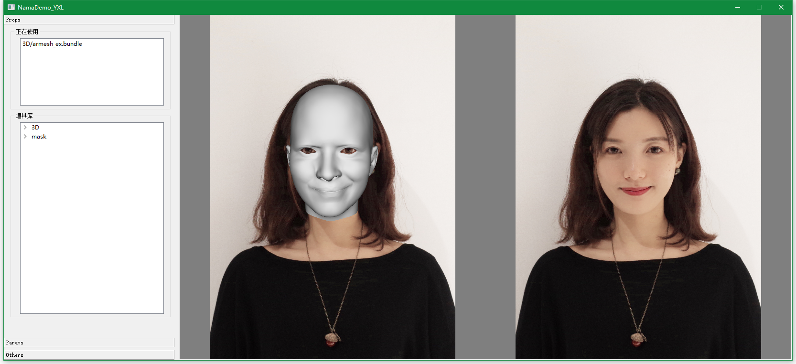
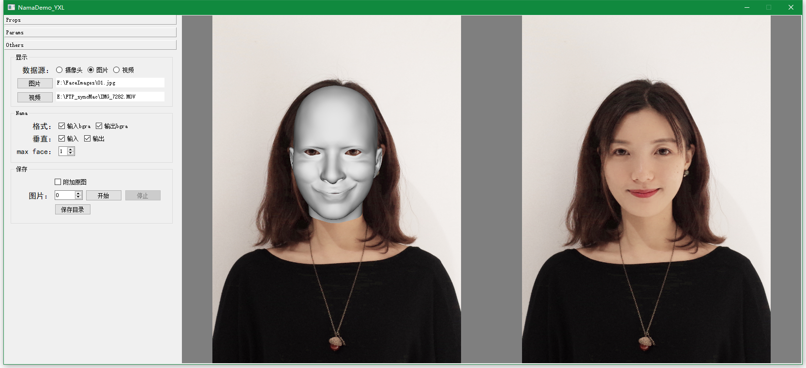

# description
A demo of Nama ([a SDK about face](http://www.faceunity.com)).

# paths
- controls: resources/ctrl_config.json
- prop: resources/props/
- Nama:   
  - thirdparty/Nama/authpack.h
  - thirdparty/Nama/Win64/Release/*.dll *.lib
  - thirdparty/Nama/Win64/Debug/*.dll *.lib

# features
- multiple input sources: camera, image, video etc.
- input source's aspect: vertical vs. horizontal
- adding controls according to a json file (resources/ctrl_config.json). The controls is used to set parameters of Nama's props
- no limits to props used
- auto load avaliable props
- saving results

# screenshots





# requirement
- VS2015
- Qt 5.*
- OpenCV
- [Nama SDK](https://github.com/Faceunity)

# ctrl_config.json

All controls' setting are in node "params". Each sub-node within "params" is a page in the applications.
```C
{
  "params":{
    "page0":[
      {
        //1th control        
      },
      {
        //2th control
      }
    ],
    "page1":[
      {
        //3th control
      }
    ]
    ...
  }
}
```
## control configuration
- checkbox
```C
{
	"type": "checkbox",
	"show_name": "is_beauty_on",
	"tooltip": "is_beauty_on",
	"param": "is_beauty_on",
	"val": false
}
```
- slider
```C
{
	"type": "slider",
	"show_name": "美白",
	"tooltip": "",
	"param": "color_level",
	"val": 0,
	"scale": 0.01,
	"range": [0, 100]
}
```
- combobox
```C
{
	"type": "combobox",
	"show_name": "filter",
	"tooltip": "",
	"param": "filter_name",
	"val": "nature",
	"combo_texts": ["nature", "delta", "electric", "slowlived"]
}
```
- slider list
```C
{
	"type": "slider_list",
	"show_name": "rotate",
	"tooltip": "",
	"param": "rotate",
	"vals": [0,0,0,0],
	"min": [0,0,0,0],
	"max": [100,100,100,100],
	"scales": [0.01,0.01,0.01,0.01],
	"names": ["a", "b", "c", "d"]
}
```
- horizontal line
```C
{
	"type": "h_line"
}
```
